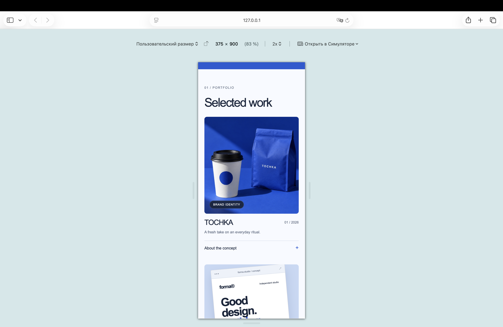
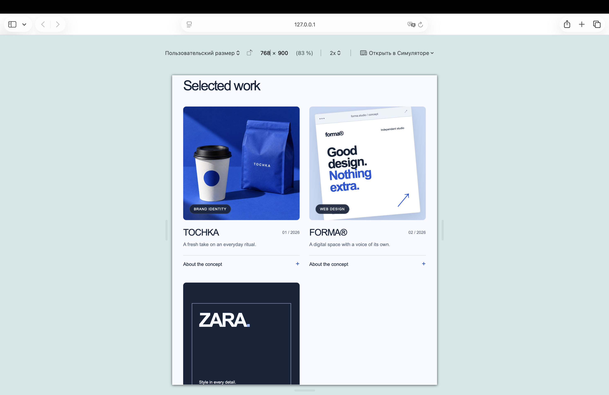
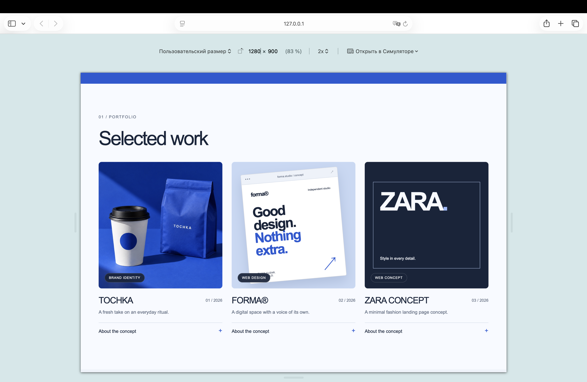

# Designer Portfolio (Dias Tleugabylov IT1-2305)
## Topic : A designer portfolio with work, services, and contacts.
## Website : https://tleugabylov-dias.github.io/landing-tleugabylov/
## Features:
1. Semantic HTML: header, nav, main, section, article, and footer.
2. Work, About, Services, and Contact sections.
3. Contact form with labels and required name, email, and message fields.
4. Heading hierarchy and descriptive image alt text.
5. Page title, meta description, viewport, and favicon.
6. Responsive CSS for mobile and desktop.
7. Navigation links to sections on the same page.
8. The contact form is a demo and does not send messages.
## Responsive layout
### Phone — 375 px

### Tablet — 768 px

### Desktop — 1280 px

## Why I chose Sass and BEM
Sass helps me keep repeated colors and screen widths in variables. I use a mixin for media queries so the phone and tablet rules are easier to manage. Nesting lets me group related styles together. BEM helps me understand which part of the page a class belongs to. Compared with Bootstrap and Tailwind, I have more control over the design, but I need to write more CSS myself. Sass also requires an extra compilation step because GitHub Pages only uses the generated CSS file.
## AI use
I used ChatGPT/Codex to help with the Sass structure, responsive layout, and README. I reviewed the code and can explain the changes during the presentation.
